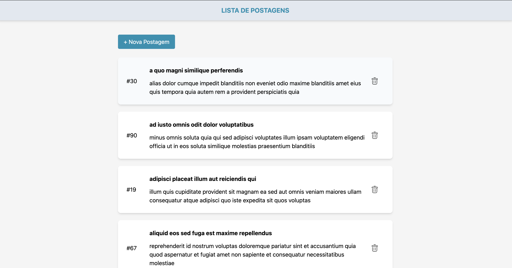
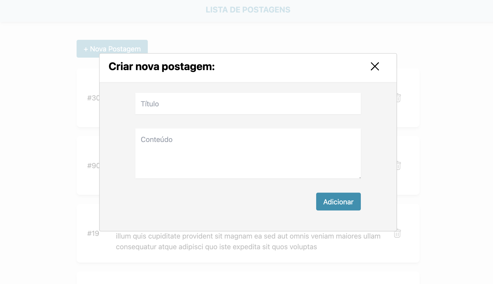
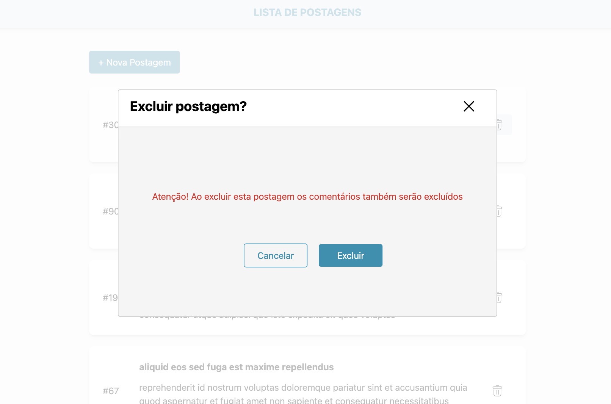
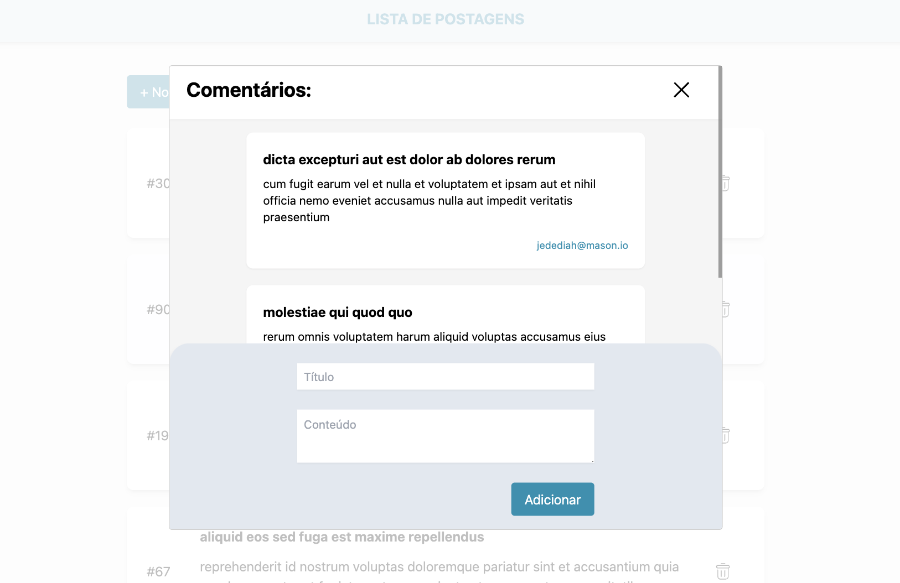

# Blog Posts

This blog application built with React, TypeScript, and Vite allows users to create posts, view comments on the posts, comment on posts, and delete posts.

## Features

- **Create Post**: Users can create new posts.
- **View Comments**: Users can view comments on each post.
- **Comment on Post**: Users can leave comments on posts.
- **Delete Post**: Users can delete posts.

## Screen Shots









## Installation

To set up the Blog Post Application, follow these steps:

1. Clone the repository:
   ```bash
    git clone https://github.com/dieegomr/blog-post.git
    ```

2. Install dependencies:
   ```bash
    yarn
    ```

3. Copy `.env.example` and use it as `.env` by running the following command:

    For Unix/Linux/MacOS:
    ```bash
    cp .env.example .env
    ```

    For Windows:
    ```cmd
    copy .env.example .env
    ```

4. Fill in the environment variables in the .env file with your own values.

5. Execute the following command to start the project in development mode:
   ```bash
    yarn dev
    ```

### Deployed Application

The Blog Post Application is deployed and accessible at [Blod Post](https://dieegomr.github.io/blog-post/).
